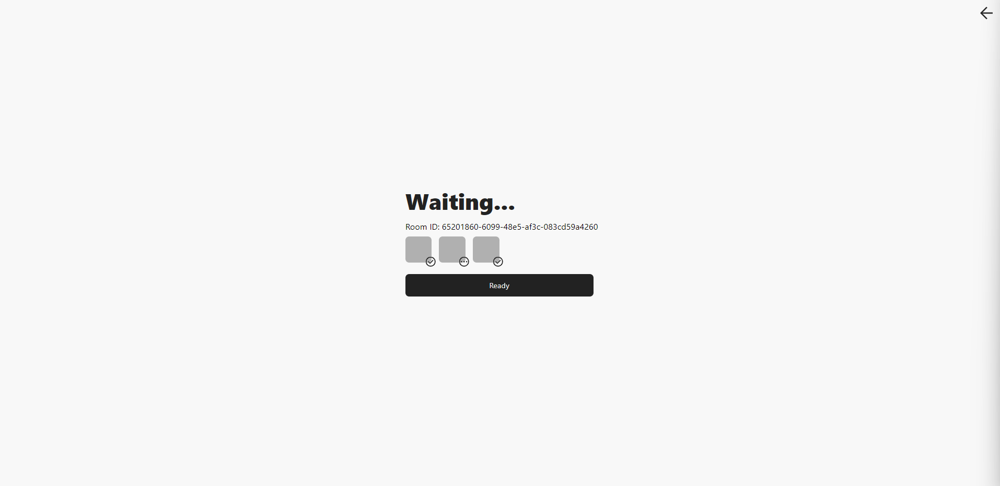
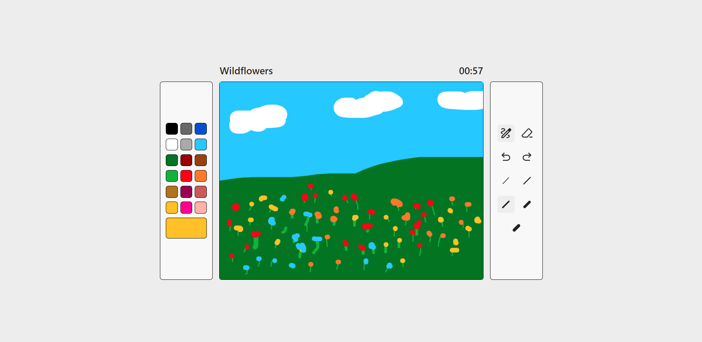
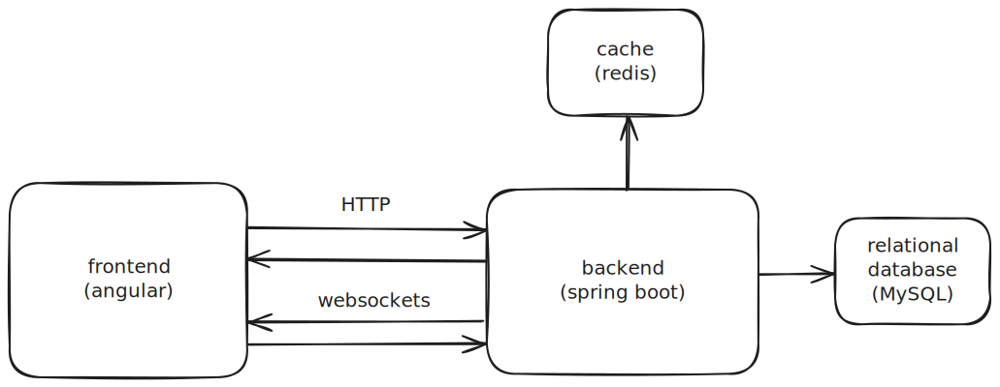

⚠️ In development 

# Drawww

Drawww is a real-time multiplayer web application developed with Angular and Java Spring Boot. Players compete in various drawing challenges where they are assigned prompts, create drawings, and then vote on each other's artwork.




## Tech Stack and Architecture

- **Frontend:** Angular v11, RxStompService, Fabric.js, Tailwind CSS
- **Backend:** Java, Spring Boot, WebSocket, Redis
- **Communication:** HTTP comunication, WebSockets for real-time updates and data exchange.



## Getting Started

To run this project locally, follow these steps:

1. Clone the repository:

```
git clone https://github.com/yourusername/drawing-contest-game.git
```

2. Backend Setup:
- Navigate to the backend directory:

```
cd backend
```

- Copy the example environment configuration and set up your environment variables:

```
cp src/main/resources/env.properties.example src/main/resources/env.properties
```

- Build and run the backend application using Maven:

```
mvn spring-boot:run
```

3. Frontend Setup:

- Navigate to the frontend directory:

```
cd frontend
```

- Install dependencies and run the Angular development server:

```
npm install
ng serve
```

- Open your browser and navigate to http://localhost:4200 to start playing.

## Future Improvements

- **Enhanced Game Modes:** Adding more diverse game modes and challenges.
- **Leaderboard and Statistics:** Implementing a global leaderboard and detailed player statistics.
- **Mobile Support:** Optimizing the game for mobile devices.

## Contributing
Feel free to contribute. Please fork the repository and submit a pull request for any features, bug fixes, or enhancements.
